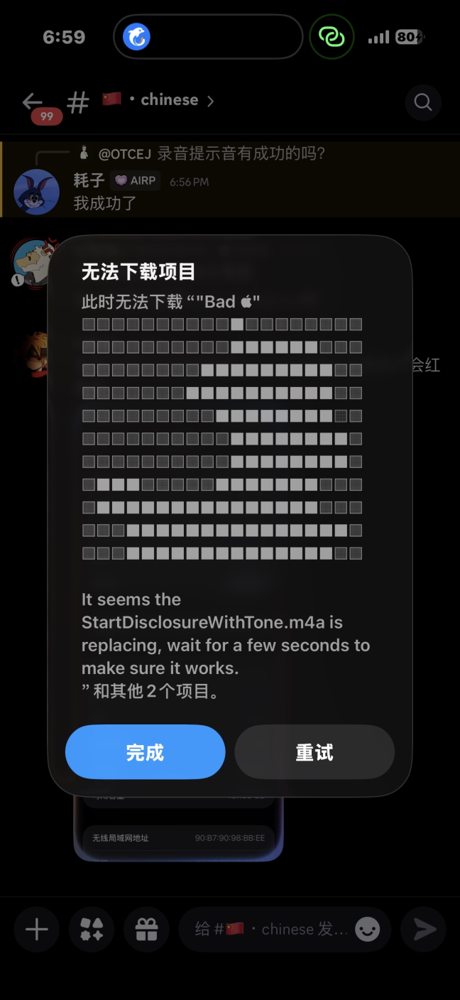
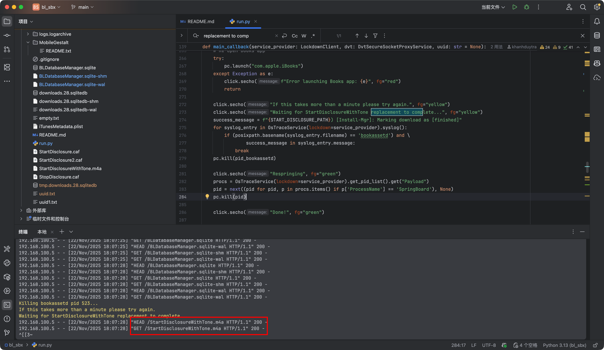

# bl_sbx

## 通过替换 iOS 通话录音提醒音频文件为无声音频文件实现禁用通话录音提醒

此 fork 版本已添加无声音频文件 `StartDisclosureWithTone.m4a` 与 `StopDisclosure.caf`，无需自行准备无声音频文件。

# 使用说明

## 前提条件

支持 iOS 18 - iOS 26.2b1，需要在 M 芯片的 macOS 上运行。

手机和电脑需要在同一个内网，电脑上不要开启 VPN/TUN/TAP 等虚拟网卡。

## 操作步骤

### 获取设备的 UDID

手机连接到 macOS 电脑，打开「访达」，在左侧栏选择设备，多次点击设备名称下方的小字，即可看到设备的 UDID，复制保存备用。


### 安装依赖

macOS 电脑上准备 PyCharm 和 Python 3.13 环境，PyCharm 打开本项目和 `run.py` 文件，根据提示安装所有依赖包。

### 运行脚本

首先解锁手机，回到主屏幕，连接电脑，PyCharm 左下角打开终端，运行以下命令：

```bash
python run.py <udid> /path/to/StartDisclosureWithTone.m4a
```

其中 `<udid>` 替换为前面获取的设备 UDID，`/path/to/StartDisclosureWithTone.m4a` 替换为无声音频文件的路径。

例如：

```bash
python run.py 00008103-001C195E0C88001A /Users/haozi/bl_sbx/StartDisclosureWithTone.m4a
```

首次运行设备会重启以尝试获取 `bookassetd` 的容器 UUID，如果提示失败的话，需要按提示手动去图书应用下载一本书，即可获取成功。

UUID 获取成功后，脚本会自动上传需要的文件并杀死相关进程，完成后手机上会弹窗提示下载失败。



此时不要点「完成」，点「重试」，点几次之后脚本会打开图书App，电脑日志显示有 `StartDisclosureWithTone.m4a` 的访问记录，基本就意味着替换成功了。



然后点「完成」等一分钟杀掉电话后台，拨打电话测试即可，如果不行的话，可以再运行一次脚本多试几次。

如需替换停止录音提醒音频文件 `StopDisclosure.caf`，在 `run.py` 全局搜索 `StartDisclosureWithTone.m4a`，替换为 `StopDisclosure.caf` 后再运行脚本即可。

注意成功之后不要重启手机，否则有可能会失效，需要重新运行脚本。

另外目前发现即使不重启过一段时间也可能会自己还原回去，不知道未来有没有解。

### 感谢

- [bl_sbx 原项目](https://github.com/khanhduytran0/bl_sbx)
- [misaka 团队的 bl_sbx](https://github.com/34306/bl_sbx)

This project is for **educational purposes only**.  
Do **not** use it for illegal activities.  
Apple may patch this behavior at any time.
